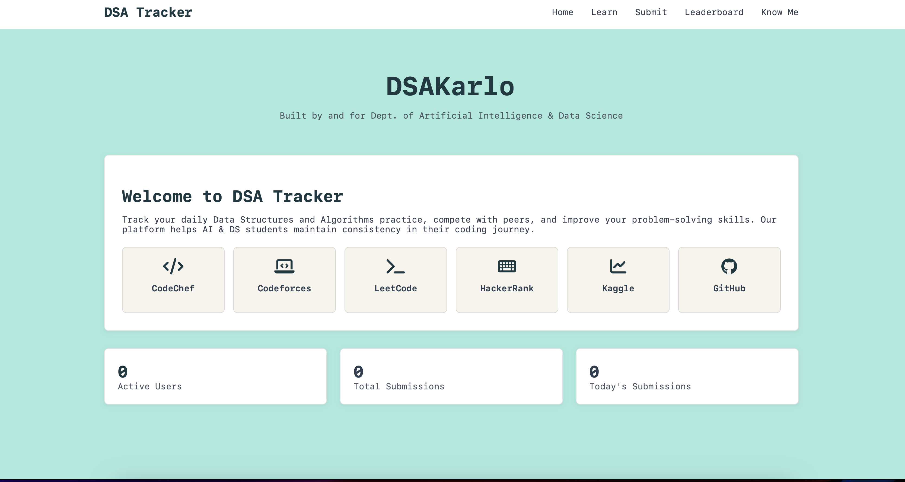
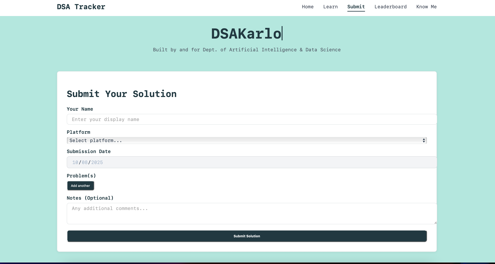
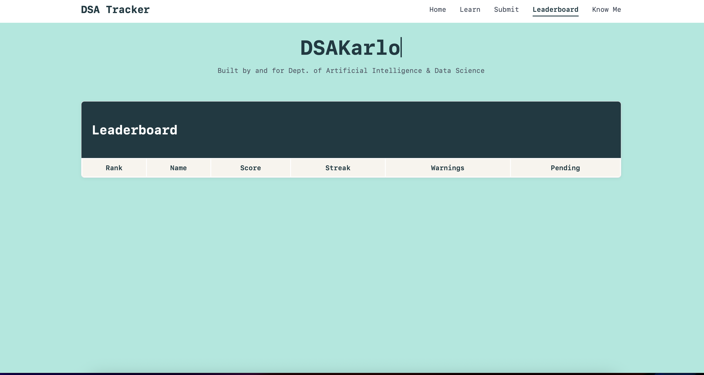

#  DSA Tracker
The **DSA Tracker** is a simple, interactive web tool to help you log and monitor your daily Data Structures & Algorithms practice.  
It’s built with **HTML, CSS, and JavaScript** to provide a lightweight and responsive experience.

---

##  Live Demo
[ Click here to try the DSA Tracker](https://your-demo-link.com) 

---

##  Screenshots

### Home Page

### Add Problem Page

### Leaderboard Page

---

## Features
-  **Log Problems** — Record problem links from platforms like LeetCode, Codeforces, CodeChef, etc.  
-  **Daily Goals** — Track your streak and see pending problems.  
-  **Leaderboard (optional)** — Compare progress with peers.  
-  **Clean UI** — Minimal design for focus and speed.  
-  **No Heavy Dependencies** — Runs in the browser.
